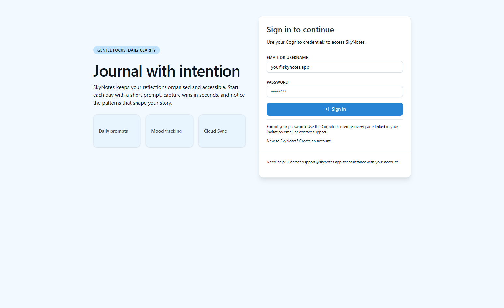
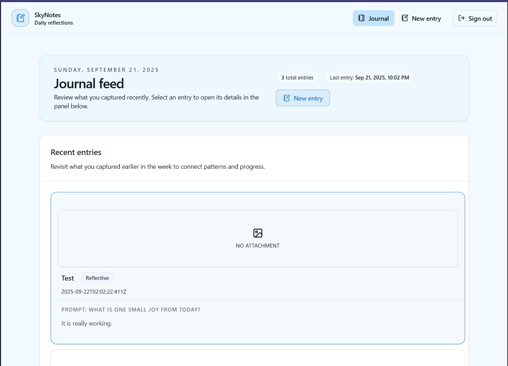
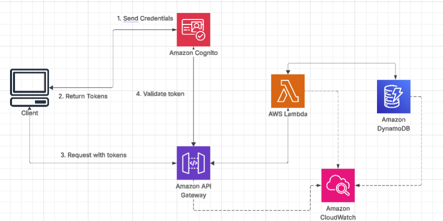

# SkyNotes 📝☁️

SkyNotes is a **serverless journaling app** built entirely on **AWS services**.  
It allows users to securely create, store, and manage personal journal entries in the cloud.  
This is my first app using AWS, and it showcases a full-stack serverless architecture.

---

## 🌟 Preview

  
*Hero screen of SkyNotes*

  
*Home page showing journal entries*

---

## 🚀 Features

- ✍️ Create and manage personal journal entries  
- 🔐 Secure authentication with **AWS Cognito User Pools**  
- 🌐 Serverless APIs using **API Gateway** and **Lambda Functions**  
- 📦 Persistent storage with **DynamoDB**  
- 📊 Logging and monitoring with **CloudWatch**  
- ⚡ Frontend powered by **React.js**  

---

## 🛠️ Tech Stack

### Client
- **React.js** frontend
- Fetches data from API Gateway
- Authentication handled via Cognito tokens

### Serverless Backend
- **AWS Cognito** → User authentication & JWT tokens  
- **Amazon API Gateway** → Entry point for client requests  
- **AWS Lambda** → Business logic (CRUD for journal entries)  
- **Amazon DynamoDB** → NoSQL data storage for entries  
- **Amazon CloudWatch** → Centralized logging & monitoring  

---

## 🖼️ Architecture

  
*High-level AWS serverless architecture of SkyNotes*

---

## ⚙️ Setup & Deployment

### Prerequisites
- Node.js (v22 or later recommended)  
- AWS CLI configured with credentials  
- AWS SAM CLI (for local testing & deployment)  

### Steps
1. Clone the repository:
   ```bash
   git clone https://github.com/yourusername/skynotes.git
   cd skynotes
